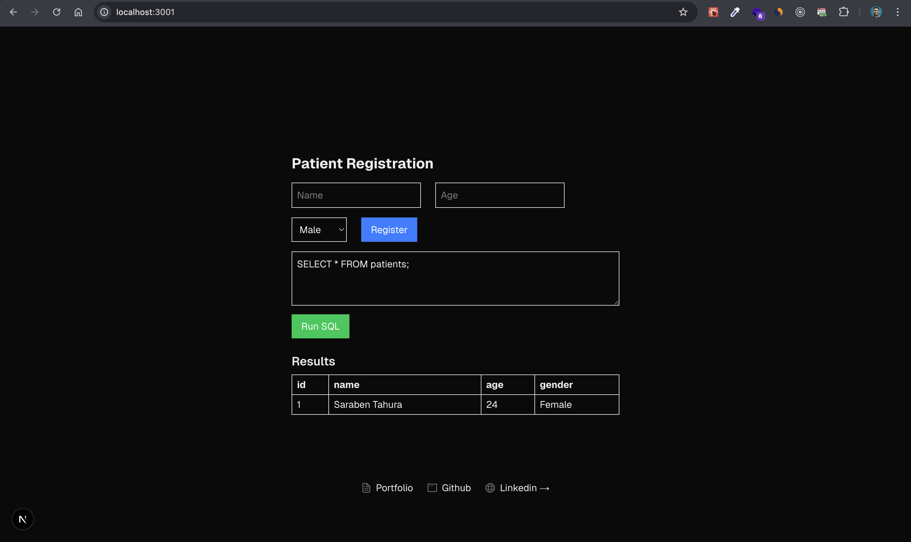

This is a [Next.js](https://nextjs.org) project bootstrapped with [`create-next-app`](https://nextjs.org/docs/app/api-reference/cli/create-next-app).

## Getting Started

First, run the development server:

```bash
npm run dev
# or
yarn dev
# or
pnpm dev
# or
bun dev
```

Open [http://localhost:3000](http://localhost:3000) with your browser to see the result.

You can start editing the page by modifying `app/page.tsx`. The page auto-updates as you edit the file.

This project uses [`next/font`](https://nextjs.org/docs/app/building-your-application/optimizing/fonts) to automatically optimize and load [Geist](https://vercel.com/font), a new font family for Vercel.

## Learn More

To learn more about Next.js, take a look at the following resources:

- [Next.js Documentation](https://nextjs.org/docs) - learn about Next.js features and API.
- [Learn Next.js](https://nextjs.org/learn) - an interactive Next.js tutorial.

You can check out [the Next.js GitHub repository](https://github.com/vercel/next.js) - your feedback and contributions are welcome!

## Deploy on Vercel

The easiest way to deploy your Next.js app is to use the [Vercel Platform](https://vercel.com/new?utm_medium=default-template&filter=next.js&utm_source=create-next-app&utm_campaign=create-next-app-readme) from the creators of Next.js.

Check out our [Next.js deployment documentation](https://nextjs.org/docs/app/building-your-application/deploying) for more details.


# Patient Management App (Frontend-Only, Persistent Storage)

This is a lightweight Patient Management System built using **Next.js** and **TypeScript**, with a fully **frontend-only persistent database** using [PGlite](https://electric-sql.com/docs/pglite/). It allows users to add, view, and manage patient records directly in the browser, and persists data even after page refreshes using IndexedDB.

## ✨ Features

- 📋 Add and store patient information (Name, Age, Gender)
- 🗃️ Persistent data storage using `PGlite` + `IndexedDB`
- 🔁 Auto-reloads data across browser tabs via `BroadcastChannel`
- 🧠 Powered by `Next.js` + `TypeScript`
- 📦 Zero backend — entire logic lives in the browser
- 📱 Responsive UI with scrollable results section

---

## ⚙️ Tech Stack

| Tool | Purpose |
|------|---------|
| [Next.js](https://nextjs.org/) | React framework for building web apps |
| [TypeScript](https://www.typescriptlang.org/) | Strongly typed JavaScript |
| [PGlite](https://electric-sql.com/docs/pglite/) | Lightweight Postgres-compatible DB that works in-browser |
| [IndexedDB](https://developer.mozilla.org/en-US/docs/Web/API/IndexedDB_API) | Persistent client-side storage |
| [BroadcastChannel API](https://developer.mozilla.org/en-US/docs/Web/API/BroadcastChannel) | Real-time multi-tab sync |

---

## 🧠 How It Works

- **Database Initialization**: On first load, PGlite initializes an IndexedDB-based Postgres instance.
- **Table Creation**: A `patients` table is created if not already existing.
- **Persistence**: All data is stored in `idb://patient-db`, ensuring data survives refreshes.
- **Form Submission**: Input is sanitized and inserted via SQL.
- **Data Rendering**: Query results are rendered dynamically, and the result table is scrollable if height exceeds 20vh.

---

## 📷 Screenshots


---

## 🧪 Running Locally

```bash
# Clone the repo
git clone https://github.com/your-username/mpatient.git

# Navigate into the folder
cd mpatient

# Install dependencies
npm install

# Start the development server
npm run dev
